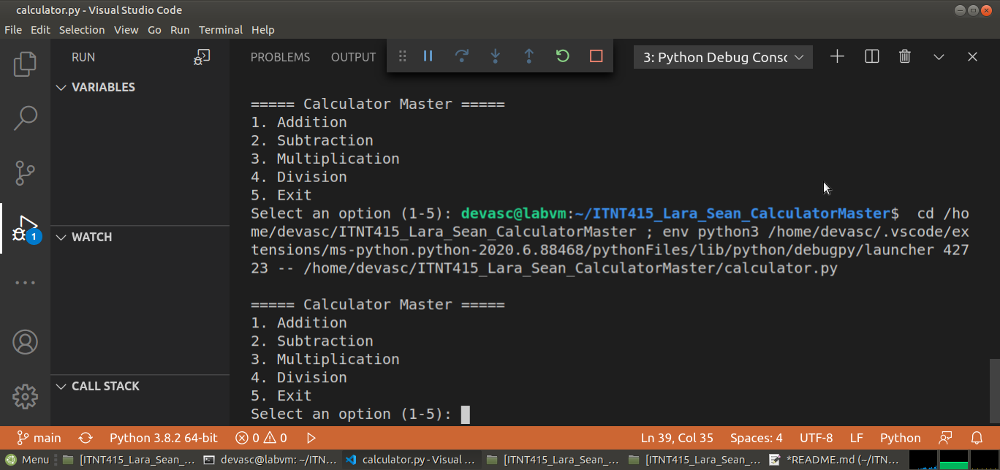

# Calc Master (Calc is short for Calculator)

Lara, Sean
ITNT415 - BIT42

## Project Description
Calc Master is a menu-driven Python calculator built using Git and GitHub
branching workflow. Each arithmetic operation (addition, subtraction,
multiplication, division) was developed on its own feature branch and
merged into main via Pull Requests, following individual version control
best practices.

## Branch Structure
- `main` — calculator skeleton and integrated final version
- `addition_Lara` — implements the addition operation
- `subtraction_Lara` — implements the subtraction operation
- `multiplication_Lara` — implements the multiplication operation
- `division_Lara` — implements the division operation, including
  division-by-zero handling

## Program Features
- Menu-driven interface using symbols (`+`, `-`, `*`, `/`, `x` to exit)
- Input validation for non-numeric entries
- Division-by-zero handling
- Continuous execution until the user chooses to exit


## How to Run
```bash
python calculator.py
```

## Sample Execution Screenshot

